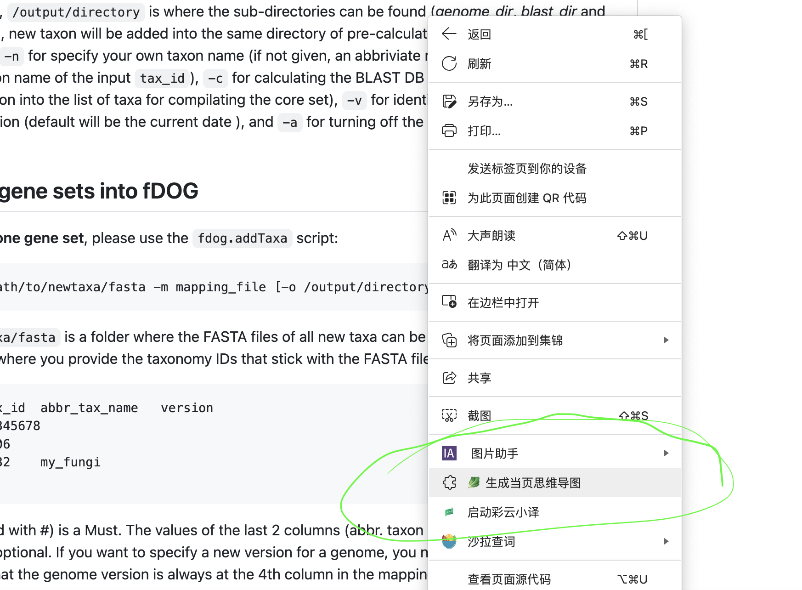

# doc2mindmap
一款把网页文章内容生成为思维导图的浏览器AI插件，很方便。  
这是我大三的期末小作业的一部分，非常简单，开源出来供学习浏览器插件开发如何与AI模型结合，做成工具。

## 安装
下载代码，在chrome、edge浏览器中打开设置-扩展程序，加载已解压的文件夹。

## 使用方法
这是一个浏览器插件用于生成思维导图，请打开content.js代码将其中的apiurl和apikey换成你通过vllm部署自己模型的后端url或者任意openai格式的模型后端。默认使用的是作者自己的deepseek云端apikey，仅供演示不稳定，请替换成自己的apikey。

## 效果展示

